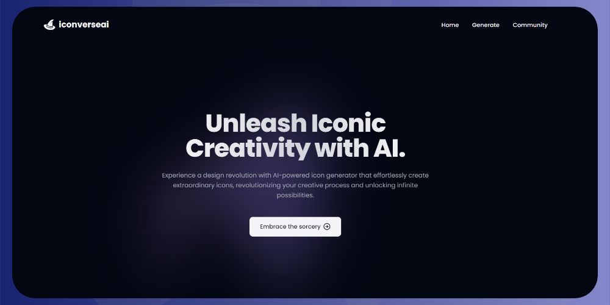

# **iconverseai**

---

Unlock your creativity and unleash the magic of AI-generated icons with IconverseAI. This innovative app combines the power of artificial intelligence with enchanting design elements to help you create captivating icons effortlessly.

---

## Features

- **AI Icon Generation**: Utilize cutting-edge AI algorithms to generate stunning icons for various purposes, including websites, mobile apps, presentations, and more.
- **Intuitive Interface**: Enjoy a user-friendly interface that makes it easy to navigate through the app and customize icons according to your preferences.
- **Versatile Icon Library**: Access a vast library of pre-designed icons or customize and personalize them to suit your specific needs.

## Installation

1. Clone the repository: `git clone https://github.com/sanketghosh/iconverseai.git`
2. Install the required dependencies: `npm install`
3. Start the app: `npm start`

## Usage

1. Launch the IconverseAI app.
2. Choose your preferred settings and customization options.
3. Click on the "Generate Icon" button to create a magical icon.
4. Customize and fine-tune the generated icon as needed.
5. Export the final icon in the desired format.
6. Integrate the icon into your projects and witness the magic!

## Contributions

Contributions are welcome! If you encounter any issues or have suggestions for improvements, please open an issue or submit a pull request.

## License

This project is licensed under the [MIT License](LICENSE).
